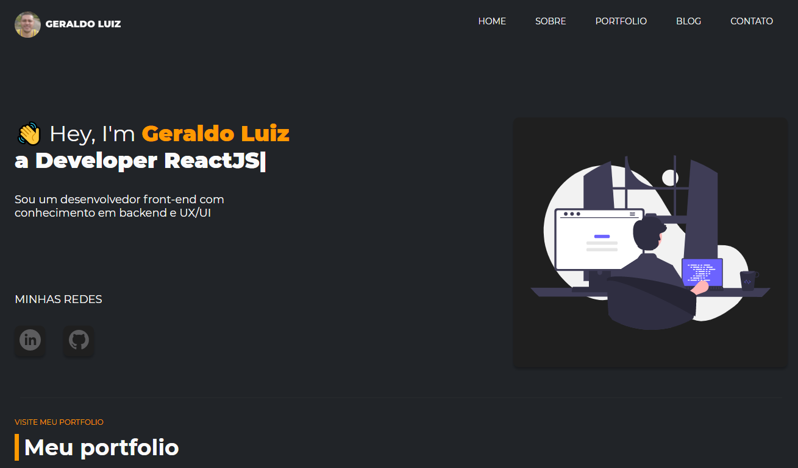
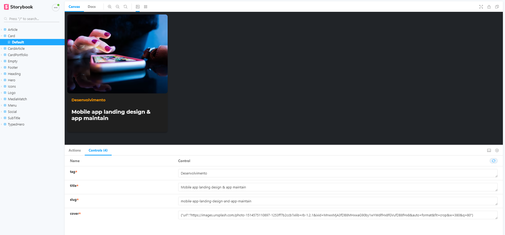

## Frontend Geraldo Luiz

My portfolio with some works as a software engineer. 🤓 💪 🚀 😁

## Preview

## Storybook

## Commands

- `dev`: runs your application on `localhost:3000`
- `build`: creates the production build version
- `start`: starts a simple server with the build production code
- `lint`: runs the linter in all components and pages
- `test`: runs jest to test all components and pages
- `test:watch`: runs jest in watch mode
- `storybook`: runs storybook on `localhost:6006`
- `build-storybook`: create the build version of storybook

## Techs

 - [x] React
 - [x] Typescript
 - [x] NextJS
 - [x] React Testing Library
 - [x] Jest
 - [x] Styled Components
 - [x] Storybook
 - [x] Eslint
 - [x] Prettier
 - [x] Husky

Estrutura do projeto.

## Diretórios

Estrutura do projeto.

    .
    ├── node_modules
    ├── src
    ├──────── components
    ├──────── pages
    ├──────── graphql
    ├──────── styles
    ├── .gitignore
    ├── .prettierrc
    ├── .editorconfig
    ├── .eslint.js
    ├── package.json
    └── README.md

1.  **`/node_modules`**: Este diretório contém todos os módulos de código dos quais seu projeto depende (pacotes npm) são instalados automaticamente.

2.  **`/src`**: Este diretório conterá todo o código relacionado ao que você verá no front-end do site (o que você vê no navegador), como o cabeçalho do site ou um modelo de página. `src` é uma convenção para "código fonte ".

3.  **`.gitignore`**: Este arquivo informa ao git quais arquivos ele não deve rastrear / não manter um histórico de versão.

4.  **`.prettierrc`**: Este é um arquivo de configuração para Prettier é uma ferramenta para ajudar a manter a formatação do código consistente e para manter um padrão. [Prettier](https://prettier.io/).

5.  **`.eslint.json`**: ESLint é uma ferramenta de análise de código estática para identificar padrões problemáticos encontrados no código JavaScript. [Eslint](https://eslint.org/).

6.  **`.editorconfig`**: O EditorConfig ajuda a manter estilos de codificação consistentes para vários desenvolvedores que trabalham no mesmo projeto em vários editores e IDEs. [Editorconfig](https://editorconfig.org/)

7. **`package-lock.json`** Este é um arquivo gerado automaticamente com base nas versões exatas das dependências do npm que foram instaladas para o seu projeto. ** (Você não altera este arquivo diretamente)**

8. **`package.json`**: Um arquivo é executado para projetos Node.js, que inclui itens como metadados (nome, autor do projeto etc.). Este arquivo é como o npm sabe quais pacotes instalar para o seu projeto.
